# AWS Quick Suite Architecture - Mermaid Diagrams

## Main Architecture Diagram

## Flow 1: Autonomous Restock-to-Price Adjustment (A-RPA)

```mermaid
flowchart LR
    IMS[Inventory Management<br/>System]
    QI[Quick Index]
    QAA[Quick Automate<br/>Agent]
    DETECT{Detects:<br/>Low Stock Alert}
    PE[Pricing Engine<br/>Dynamic Price ↑]
    CMS[Merchandising CMS<br/>Update Product Page]
    LOG[Logistics System<br/>Priority Restock]
    SLACK[Slack Alert]
    
    IMS --> QI
    QI --> QAA
    QAA --> DETECT
    DETECT --> PE
    DETECT --> CMS
    PE --> SLACK
    CMS --> SLACK
    SLACK --> LOG
    
    classDef source fill:#3B48CC,stroke:#232F3E,stroke-width:2px,color:#fff
    classDef agent fill:#FF9900,stroke:#232F3E,stroke-width:3px,color:#fff
    classDef action fill:#147EBA,stroke:#232F3E,stroke-width:2px,color:#fff
    classDef alert fill:#7AA116,stroke:#232F3E,stroke-width:2px,color:#fff
    
    class IMS source
    class QI,QAA,DETECT agent
    class PE,CMS,LOG action
    class SLACK alert
```

## Flow 2: FitMap Intelligence Query

## Flow 3: Sales Assistant (Embedded in POS)

## Flow 4: Automated Financial Reporting

## Security & Governance Layer

```mermaid
flowchart TD
    IAM[IAM & ACCESS CONTROL<br/>• Role-Based Access RBAC<br/>• Data Source Permissions<br/>• Agent Action Boundaries]
    AUDIT[AUDIT & COMPLIANCE<br/>• CloudTrail Logging<br/>• Action Transparency<br/>• Data Lineage Tracking]
    GOV[DATA GOVERNANCE<br/>• Runs in DXL AWS Tenancy<br/>• No Data Leaves Environment<br/>• Full Control & Sovereignty]
    
    IAM --> AUDIT
    AUDIT --> GOV
    
    classDef security fill:#DD344C,stroke:#232F3E,stroke-width:3px,color:#fff
    
    class IAM,AUDIT,GOV security
```

## Simplified High-Level Architecture

---

## How to Use These Diagrams

### Option 1: Mermaid Live Editor
1. Go to https://mermaid.live/
2. Copy any diagram code above
3. Paste into the editor
4. Export as PNG, SVG, or PDF

### Option 2: Draw.io with Mermaid Plugin
1. Go to https://app.diagrams.net/
2. Click "Arrange" → "Insert" → "Advanced" → "Mermaid"
3. Paste the Mermaid code
4. Click "Insert"

### Option 3: VS Code with Mermaid Extension
1. Install "Markdown Preview Mermaid Support" extension
2. Create a .md file with the Mermaid code
3. Preview the markdown file
4. Right-click diagram to export

### Option 4: GitHub/GitLab
- Both platforms natively render Mermaid diagrams in markdown files
- Just commit the .md file with Mermaid code blocks

---

## Color Legend

- 🟠 **Orange (#FF9900)**: AWS Quick Suite Components
- 🔵 **Blue (#3B48CC)**: Data Sources
- 🔷 **Light Blue (#147EBA)**: Enterprise Applications & Actions
- ⬛ **Dark (#232F3E)**: AWS Foundation Services
- 🟢 **Green (#7AA116)**: User Interfaces
- 🔴 **Red (#DD344C)**: Security & Governance
